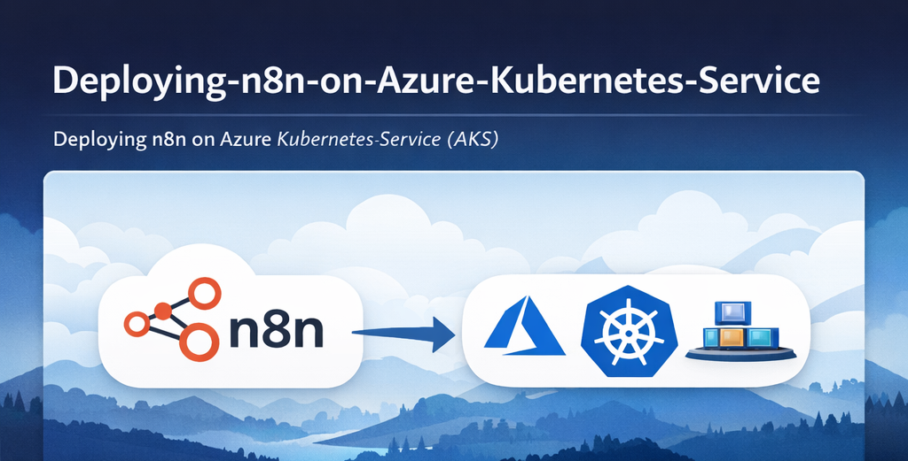

# Deploying-n8n-on--Azure-Kubernetes-Service
This is the complete step-by-step tutorial about how to successfully install and setup n8n Community Edition (free and open-source) on the Linux machine. All the steps are completely tested and verified as of Dec 2025. You can easily just follow the steps and configure your own self-hosted n8n.

